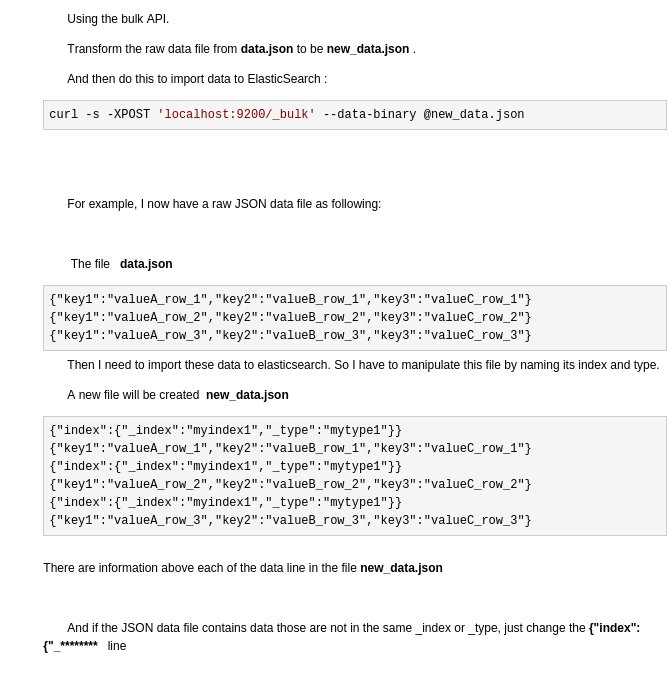
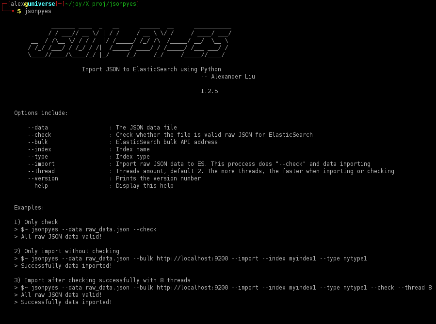
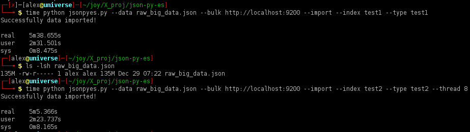
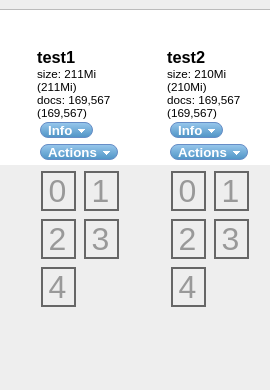
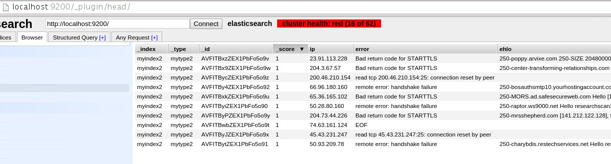
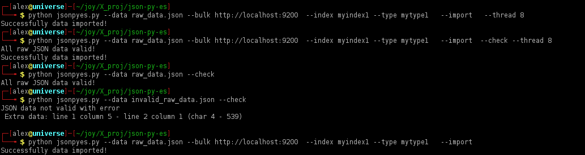
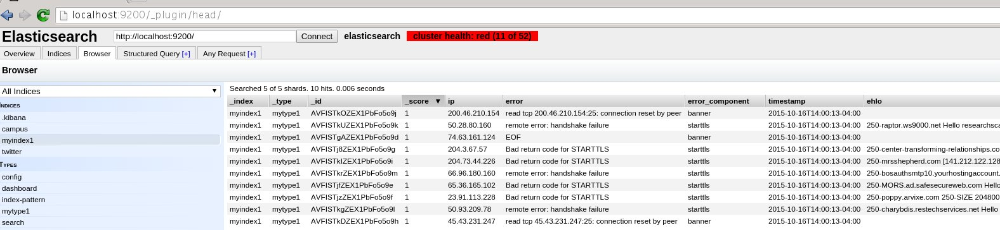

json-py-es
==========

[](https://travis-ci.org/xros/jsonpyes)
[](https://github.com/xros/jsonpyes/releases)
[](https://pypi.python.org/jsonpyes)
[](https://github.com/xros/jsonpyes/blob/master/LICENSE)

Alexander Liu

* To import raw JSON data files to ElasticSearch using Python in one line of commands

### Installation

* ```pip install jsonpyes```  

> In the past we import data in this way. Too many jobs by hands...
> 
> 
> Using ElasticSearch Bulk API to import this data, sometimes ES only recognizes data in its API way. 
> 
> But now let `json-py-es` glue them all.


jsonpyes
--------


#### Instructions:
    There are 3 proccesses of importing raw JSON data to ElasticSearch
    1. Only validating raw JSON data
    2. Without validating ,just import data to ElasticSearch
    3. After validating successfully, then import data to ElasticSearch


##### 1. Only validating
* ```jsonpyes --data raw_data.json --check```

* If the json data file is valid: 


* If the json data file is invalid: 


##### 2. Only importing without validating
* Notice: If the raw JSON data file is invalid, ElasticSearch will not import it.
* ```jsonpyes --data raw_data.json --bulk http://localhost:9200 --import --index myindex2 --type mytype2```
* Or enable multi-threads ```jsonpyes --data raw_data.json --bulk http://localhost:9200 --import --index myindex2 --type mytype2 --thread 8```


* ```jsonpyes``` supports multi-threads when importing data to elasticsearch


> As you can see these two containers have same docs loaded, if we use **_--thread 8_** it could be slightly faster.
That really depends on your computer/server resources.
This was tested on a 4GB RAM / 2.4Ghz intel i5 Linux x64 laptop system.



* And it works.


##### 3. Both validating and importing
* ```jsonpyes --data raw_data.json --bulk http://localhost:9200 --import --index myindex1 --type mytype1 --check```


* And it works.



##### Happy hacking!
