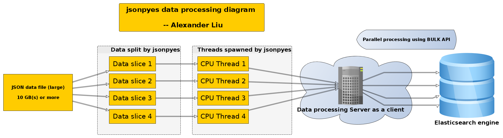

json-py-es
==========

|Downloads| |Build Status| |GitHub release| |GitHub license|

Alexander Liu

-  To import raw JSON data files to ElasticSearch in one line of
   commands

   jsonpyes diagram

Very fast -- 4 to 10 times faster when processing big data.

Installation
~~~~~~~~~~~~

``pip install jsonpyes``

    **Notice**: Before using ``pip`` to install ``jsonpyes``, firstly
    you need to install ``python-pip`` on your system. ( Supports Python
    Python2.7, 3.3, 3,4, 3.5, 3.6 )

jsonpyes
--------

.. figure:: https://raw.githubusercontent.com/xros/jsonpyes/master/static/snapshot236.png
   :alt: user interface

   user interface

Instructions:
^^^^^^^^^^^^^

::

    There are 3 proccesses of importing raw JSON data to ElasticSearch
    1. Only validating raw JSON data
    2. Without validating ,just import data to ElasticSearch
    3. After validating successfully, then import data to ElasticSearch

    A valid JSON file here refers to a JSON file stacked with many lines of data

    file valid_data.json and its content

    {"key1": "valueA", "key2": {"sub_key1": "value2A", "sub_key2": ["Good", "Morning"]}}
    {"key1": "valueB", "key2": {"sub_key1": "value2B", "sub_key2": ["Good", "Afternoon"]}}
    ...
    {"key1": "valueC", "key2": {"sub_key1": "value2C", "sub_key2": ["Good", "Evening"]}}

Functions included
------------------

1. Validating JSON format data
''''''''''''''''''''''''''''''

``jsonpyes --data raw_data.json --check``

If the json data file is valid:

.. figure:: https://raw.githubusercontent.com/xros/jsonpyes/master/static/snapshot98.jpg
   :alt: json valid

   json valid

If the json data file is invalid:

.. figure:: https://raw.githubusercontent.com/xros/jsonpyes/master/static/snapshot99.jpg
   :alt: json invalid

   json invalid

2. Only importing without validating
''''''''''''''''''''''''''''''''''''

``jsonpyes --data raw_data.json --bulk http://localhost:9200 --import --index myindex2 --type mytype2``

Notice: If the raw JSON data file is invalid, ``jsonpyes`` will not
import it.

Or enable multi-threads
``jsonpyes --data raw_data.json --bulk http://localhost:9200 --import --index myindex2 --type mytype2 --thread 8``

.. figure:: https://raw.githubusercontent.com/xros/jsonpyes/master/static/snapshot102.jpg
   :alt: no threads

   no threads

``jsonpyes`` supports multi-threads when importing data to elasticsearch

Multi-threads comparison
''''''''''''''''''''''''

1. No multi-threads

   .. figure:: https://raw.githubusercontent.com/xros/jsonpyes/master/static/snapshot237.png
      :alt: benchmarks

      benchmarks

2. With 8 threads and ``jsonpyes`` cuts files into pieces, then
   destributes to workers fairly

   .. figure:: https://raw.githubusercontent.com/xros/jsonpyes/master/static/snapshot235.png
      :alt: use helpers.bulk API with multi-threads

      use helpers.bulk API with multi-threads

    As you can see these two containers have same docs loaded, if we use
    ***--thread 8*** it could be several times faster, usually 5 to 10
    times faster. That really depends on your computer/server resources.
    This was tested on a 4GB RAM / 2.4Ghz intel i5 Linux x64 laptop
    system.

And it works.

.. figure:: https://raw.githubusercontent.com/xros/jsonpyes/master/static/snapshot105.jpg
   :alt: it works

   it works

3. Both validating and importing
''''''''''''''''''''''''''''''''

``jsonpyes --data raw_data.json --bulk http://localhost:9200 --import --index myindex1 --type mytype1 --check``

.. figure:: https://raw.githubusercontent.com/xros/jsonpyes/master/static/snapshot135.png
   :alt: validating and importing

   validating and importing

And it works.

.. figure:: https://raw.githubusercontent.com/xros/jsonpyes/master/static/snapshot101.jpg
   :alt: the results

   the results

Reference
---------

-  Algorithm handwritting

.. figure:: https://raw.githubusercontent.com/xros/jsonpyes/master/static/algo.png
   :alt: handwritting

   handwritting

Happy hacking!
''''''''''''''

.. |Downloads| image:: https://pepy.tech/badge/jsonpyes
   :target: https://pepy.tech/project/jsonpyes
.. |Build Status| image:: https://travis-ci.org/xros/jsonpyes.svg?branch=master
   :target: https://travis-ci.org/xros/jsonpyes
.. |GitHub release| image:: https://img.shields.io/github/release/xros/jsonpyes.svg
   :target: https://github.com/xros/jsonpyes/releases
.. |GitHub license| image:: https://img.shields.io/github/license/xros/jsonpyes.svg
   :target: https://github.com/xros/jsonpyes/blob/master/LICENSE
